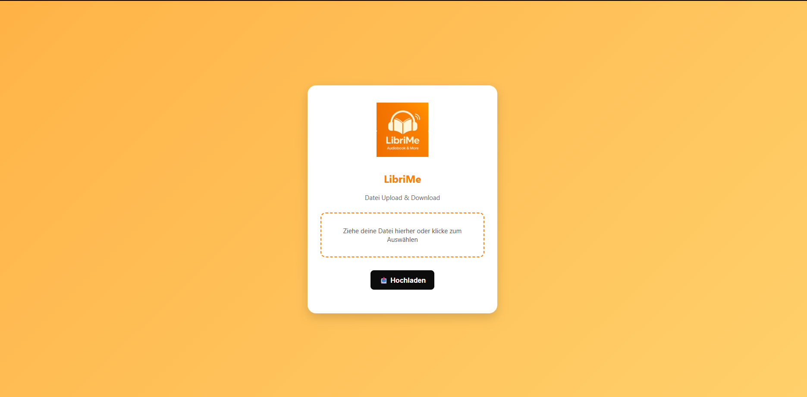

#  LibriMe 

>***"Freedom starts in your ear."***

**Have you ever struggled to get through an entire script from your last lecture?**
Or maybe you want to make your time spent on chores or while driving more productive by learning something new, but find it difficult to listen to text-to-speech audio? If so, this application might just become your new best friend.

LibriMe is an **easy-to-use** web application designed to make your day-to-day life easier by converting any text-based content into **natural** speech. Simply upload the PDF or even an image file (like JPG or PNG) containing text to listen to, and we’ll turn it into an **"audiobook experience"** for you. Powered by cutting-edge technology, the generated audio sounds like a professionally recorded audiobook, not just a generic text-to-speech voice. 

Using advanced Optical Character Recognition (OCR) technology, LibriMe can accurately extract text from scanned documents, handwritten notes, or photographed pages. The extracted text is then transformed into an immersive **"audiobook experience"**, powered by cutting-edge speech synthesis that sounds just like a professional narrator and not a robotic text-to-speech voice.

Whether it’s lecture notes, articles, or photos of printed material, LibriMe lets you listen and learn anytime, anywhere.
Start to use LibriMe for your daily learning routine because **"Freedom starts in your ear."**

---

## Meet the team
| Name                     | Role                                                     |
|--------------------------|----------------------------------------------------------|
| Florian Fuchs            | AI module development & standalone Flask version         |
| Dominik Bliem-Zupansky   | Assisted in AI module development & standalone Flask version & Documentation |
| Vladimir Tsankov         | Assisted in backend development                          |
| Philip Macheiner         | Backend development & project management                 |

---

## Keyfeatures

### Must haves
| Feature                  | Description                                     |
|--------------------------|-------------------------------------------------|
| PDF-Upload               | Upload and extraction of text from a pdf file   |
| Text-to-Audio-Conversion | Convert extracted Text to Audio                 |
| Audio-Download           | Present user with option to download audio file |

### nice to haves
| Feature                      | Description                                                     |
|------------------------------|-----------------------------------------------------------------|
| Audiofile splitting          | Option to split file in multiple smaller files                  |
| Multiuser support            | Implement Messagequeue to load balance and enable multiple user |
| Text recognition in pictures | Implement OCR to enable conversion of different filetypes       |
| Translation service          | Implement translation to different languages                    |

---

## Techstack and Architecture
### Architecture Overview

The user is presented via a web UI where can upload the chosen PDF-file/Image and trigger a conversion into an audiofile. After the conversion is done the user is presented with the audio file and the option to listen to it directly in the browser

### Techstack overview
| software part  | languageID | framework | description                                           |
| -- | -- | -- |-------------------------------------------------------|
| Frontend | TypeScript | React | User presentation layer                               |
| Backend | Java | Springboot | Request and application flow control                  |
| AI - Modul | Python | Pytorch | OCR, pdf extraction and AI model for voice generation |
 
 Due to the complexity of the AI module, the frontend will be implemented in the start-up project in the next semester for time reasons. Therefore, we present the standalone version.
---

## Getting started

### Prerequisites
- Docker Desktop installed (https://docs.docker.com/desktop)

### Local installation
1. Download the installation files (via `git clone` or directly on the git lab site)
2. Use a Terminal and navigate to recently downloaded folder an execute `docker compose up -d`. 
   (Please note that the installation can take up to 40 minutes due to the many resources.)
3. All needed container should be up and running

Hint: should there be any problems a restart od all container with `docker compose down -v` and `docker compose up -d`

### Standalone Flask Version

A standalone version using Flask is available.
This version can be accessed locally via http://localhost:5000

The standalone variant allows you to upload PDF and PNG files and convert them directly into audio files.
At the moment, however, audio output is only available in German.

## Use
1. In a browser visit the main website [localhost](http://localhost:80)
2. Upload your PDF-file or picture by pressing the upload button and choosing your file, or use the drag and drop Feature.
3. Pick the language you want the audio to be generated in.
4. Select the voice you’d like to use as the narrator for your audiobook.
5. Press "start voicing" to start the generation of the audio file.
6. After the progressbar is full you will be presented the new audiofile, which you can listen to by pressing "play audio" or download by pressing "download file".

You can go back to the upload site by pressing "Create another audiobook" on the result view.