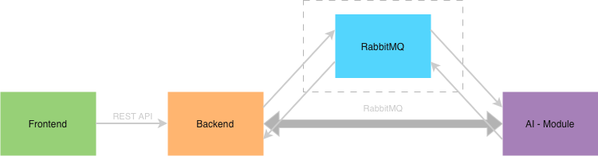

#  LibriMe

LibriMe is an automated system designed to transform text based documents into high quality audio experiences. By combining Optical Character Recognition (OCR) with neural speech synthesis, the platform enables the conversion of PDFs and images into natural sounding audiobooks.

## Key Features

The following capabilities define the LibriMe platform:

1. **Neural Speech Synthesis**: Utilizes advanced AI models to generate human like narration that maintains high engagement levels.
2. **Integrated OCR**: Processes complex document layouts from scanned notes or photographs to extract clean text.
3. **Asynchronous Processing**: Employs a message queue architecture to handle multiple conversion jobs simultaneously without impacting system performance.
4. **Multi Format Support**: Enables the conversion of PDF, JPG, PNG, and TIF files into accessible audio assets.

## Prerequisites

The system requires the following components for successful deployment:

* **Docker**: Version 20.10 or higher.
* **Docker Compose**: Version 2.0 or higher.
* **System Resources**: Minimum 16GB RAM recommended for AI model optimization and processing.
* **Network**: Stable internet connection for the initial download of neural network weights.

## Installation and Deployment

### Production Setup
The primary method for deploying LibriMe is via Docker Compose, which manages the orchestration of the backend, AI modules, and frontend services.

1. Clone the repository to the target environment.
2. Navigate to the project root directory.
3. Execute the deployment command:
   `docker compose up -d --build`

The initial setup involves downloading significant AI model data. This process can take approximately 40 minutes depending on network conditions. Once complete, the system is accessible via `http://localhost`.

### Local Development
For development purposes, services can be executed individually within their respective directories. Please refer to the module specific documentation for local configuration details.

## Operational Workflow

1. **Ingestion**: Upload documents through the web interface.
2. **Selection**: Choose the target language and preferred voice profile.
3. **Synthesis**: Start the conversion process.
4. **Completion**: Play the audio directly in the browser or download the file for offline use.

## Project Structure

* **Backend**: Java based orchestrator for job management. See [Backend Documentation](Backend/README.md).
* **AI Module**: Python services for OCR and speech synthesis.
* **Frontend**: React application for user interaction.

## Roadmap and Status

The project is currently in a stable beta phase. Future updates will focus on:
* Support for additional document formats.
* Enhanced narrator customization options.
* Integration with cloud storage providers.

## Contributing

Contributions are welcome to improve the LibriMe platform. Please submit bug reports or feature requests through the project issue tracker. Pull requests should follow the existing code style and include relevant tests.

## License

This project is released under the MIT License. See the LICENSE file for more information.

## Architecture

